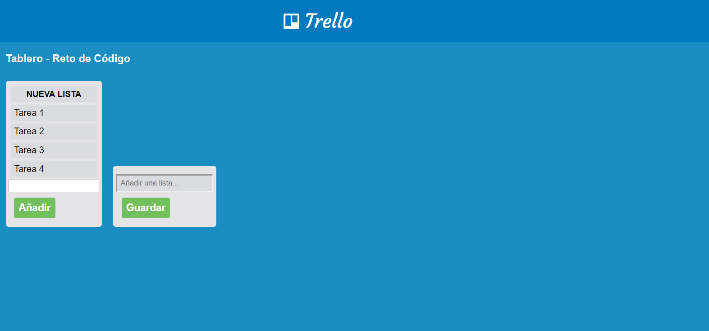

# Trello

* **Curso:** _Creando tu primer sitio web interactivo_
* **Unidad:** _ Creando interacción con JavaScript_

***

## Objetivo

En este reto, vamos a replicar el tablero de **Trello**
> Nota:  Puedes usar tu propio estilo o seguir la del sitio original.

## Desarrollo

1. *Evento para ocultar boton y añadir lista*
    `var hiddenButton = document.getElementById("addList");`
      `hiddenButton.addEventListener("click", addList);`
2. *Evento para guardar nombre de listas*
    `var save = document.getElementById("save");`
      `save.addEventListener("click", newList);`

3. *Funcion addList que se ejecuta con click*
    `function addList()`
      `var hiddenButton = document.getElementById("addList");`
        `hiddenButton.style.display="none";`
      `var showForm = document.getElementById("newForm");`
        `showForm.style.display="inline-block";`

4. *Funcion newList que se ejecuta con click*
    `function newList()`
      `newClick.addEventListener("click",añadir);`

5. *Funcion añadir que se ejecuta con click*
    `function añadir()`
      `var buttonAdd =document.createElement("input");`
        `buttonAdd.addEventListener("click", añadirTarea);`

6. *Funcion añadirTarea que se ejecuta con click*
    `function añadirTarea()`
      `var textArea= document.getElementById("textAñadir").value;`

## Resultado

